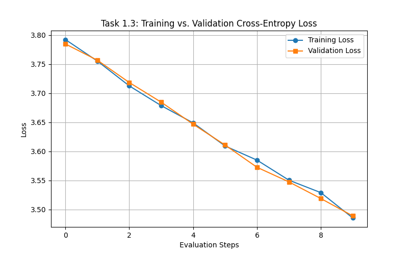
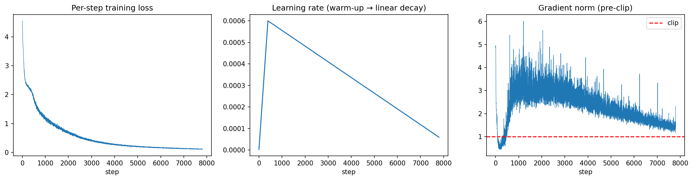

# Task 1 Results

## Data

- Dataset: TinyStories, character level
- Vocabulary size: 91
- Training data: 100K characters
- Validation data: 10K characters
- Sequence length: 256 characters

## Model

| Setting | Value |
|---|---:|
| Layers / Heads / Embedding | 6 / 6 / 192 |
| Context length | 256 |
| Activation | ReLU |
| Dropout | 0.2 |
| Parameters | 2.75M |

## Why

I chose 6 layers and 192 dimensions because they provide enough capacity while keeping the model small and efficient. I used dropout 0.2 because it helps reduce overfitting.

## Training

- Optimizer: AdamW
- Learning rate: 6e-4
- Schedule: Warm-up followed by linear decay
- Batch size: 32
- Training duration: 10 epochs
- Gradient clipping: 1.0
- Hardware: Tesla T4 GPU on Colab
- Training time: 11 minutes

## Results

| Metric | Value |
|---|---:|
| Best validation loss | 1.314 at epoch 2 |
| Perplexity at best epoch (2) | 3.72 |
| Final train / validation loss (epoch 10) | 0.055 / 2.609 |
| Perplexity (epoch 10) | 13.58 |
| Bits per character (epoch 10) | 3.76 |
| Generalization gap (val - train) | 2.553 |
| Top-1 next-character accuracy | 64.20% |
| Distinct-1 / 2 / 3 | 0.077 / 0.367 / 0.630 |
| Repeated 4-gram rate (sampling / greedy) | 22.9% / 28.6% |
| Gradient norm mean / max | 2.31 / 6.03 |
| Loss spikes / NaNs | 0 / 0 |
| Parameters | 2,750,299 |
| Training throughput | 95,654 tokens/sec |
| Generation speed | 59.7 tokens/sec |
| Peak GPU memory | 1,273 MB |
| Training time | 668 s (11 min) |

## What I Found

Validation loss was lowest at epoch 2, and after that it increased. This shows the model is overfitting because training loss continued to decrease while validation loss worsened. So I use the best model checkpoint from epoch 2 as my final model.

## Files

- Best model: `checkpoints/best_model.pt`
- Log: `reproducibility/raw_logs/task1_sadaf_20260926_050656.log`
