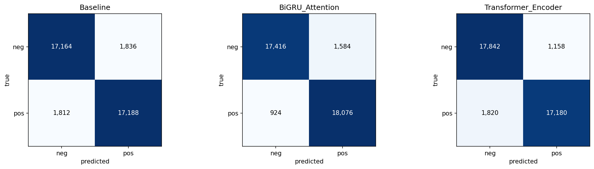
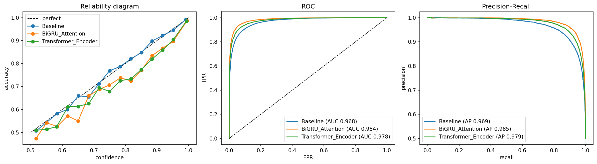

# Task 2 Results (Sadaf Fatima Syeda)

## Data

- Yelp polarity, random 100K training reviews using seed 266
- 5K reviews used for validation
- Tested on the full official test set of 38,000 reviews
- Preprocessing: fixed `\n` text, lowercased, removed links and punctuation, removed stopwords while keeping negation words (`not`, `no`, `never`), applied lemmatization, used a maximum of 256 tokens, and built a 20K-word vocabulary using only the training data

## Models

| Model | Setup | Learning rate | Parameters |
|---|---|---:|---:|
| Baseline | Embedding 128, max pooling, linear layer | 1e-3 | 2.56M |
| BiGRU + attention | Embedding 128, BiGRU hidden size 64, attention pooling | 1e-3 | 2.63M |
| Transformer encoder | Embedding 128, 4 heads, 2 layers, dropout 0.1, Task 1 attention code | 5e-4 | 2.99M |

All models used Adam, batch size 64, and 3 epochs. The best epoch was selected using validation accuracy. No pretrained embeddings were used.

## Why These Models

- **Baseline:** I used a simple embedding-plus-max-pooling model as a fast reference point with minimal computation.
- **BiGRU + attention:** I chose a BiGRU to capture word order in both directions and attention pooling to focus on the most important words.
- **Transformer encoder:** I included a Transformer to test whether self-attention could capture long-range relationships between words.

## Results

| Metric | Baseline | BiGRU | Transformer |
|---|---:|---:|---:|
| Accuracy | 0.904 | **0.934** | 0.922 |
| Accuracy 95% CI | 0.901–0.907 | 0.932–0.936 | 0.919–0.924 |
| Macro F1 | 0.904 | **0.934** | 0.922 |
| Macro F1 95% CI | 0.901–0.907 | 0.932–0.936 | 0.919–0.924 |
| Precision / Recall (macro) | 0.904 / 0.904 | 0.935 / 0.934 | 0.922 / 0.922 |
| Micro and weighted P / R / F1 | 0.904 | 0.934 | 0.922 |
| MCC | 0.808 | **0.869** | 0.844 |
| MCC 95% CI | 0.802–0.813 | 0.864–0.873 | 0.839–0.849 |
| ROC-AUC | 0.968 | **0.984** | 0.978 |
| PR-AUC | 0.969 | **0.985** | 0.979 |
| Brier score | 0.069 | **0.049** | 0.058 |
| ECE | **0.004** | 0.019 | 0.021 |
| McNemar vs baseline (p) | — | 8.1e-87 | 1.4e-36 |
| Training time | 15 s | 139 s | 193 s |
| Training examples/sec | 19,091 | 2,046 | 1,476 |
| Inference examples/sec | 35,314 | 6,514 | 4,345 |
| Peak GPU memory | 74 MB | 112 MB | 613 MB |

Hardware: Tesla T4 GPU on Google Colab.

## Confusion Matrices

   
   

- **Baseline:** TN / FP / FN / TP = 17,164 / 1,836 / 1,812 / 17,188
- **BiGRU:** TN / FP / FN / TP = 17,416 / 1,584 / 924 / 18,076
- **Transformer:** TN / FP / FN / TP = 17,842 / 1,158 / 1,820 / 17,180

## What I Found

The **BiGRU with attention performed best**, achieving 93.4% accuracy and macro F1, compared with 92.2% for the Transformer and 90.4% for the baseline. Its improvement over the baseline is statistically significant because the McNemar test has an extremely small p-value, and the confidence intervals are clearly separated. The BiGRU was slower and used more memory than the baseline, but it was faster and much more memory-efficient than the Transformer. The baseline had the best calibration according to ECE, while the BiGRU had the best Brier score. Per-slice patterns should be checked in `outputs/slice_metrics.csv`.

## Files

- Checkpoints: `checkpoints/Baseline.pt`, `checkpoints/BiGRU_Attention.pt`, `checkpoints/Transformer_Encoder.pt`
- Log: `reproducibility/raw_logs/task2_sadaf_20260926_061012.log`
- Data: `data_processed/DATA_LINK.md`
