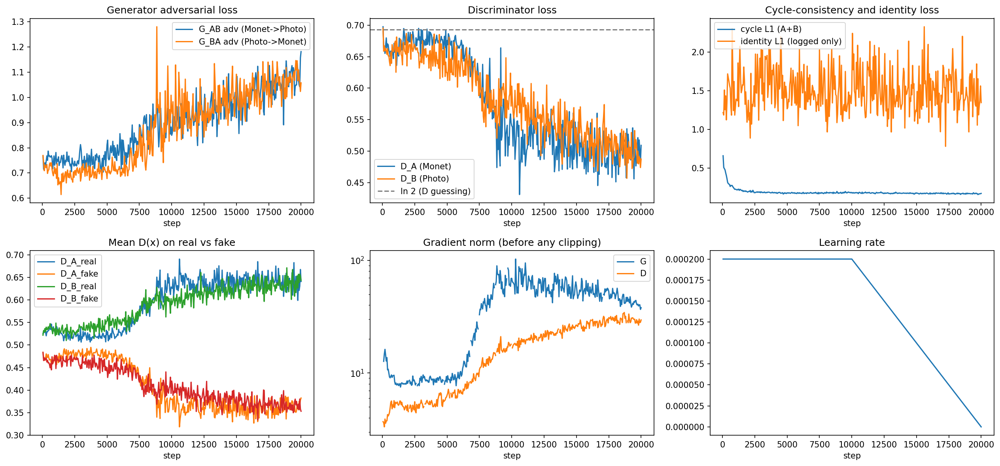
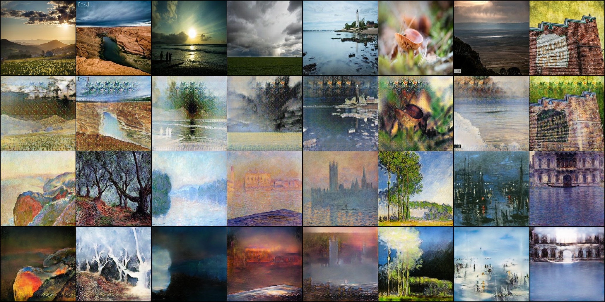

# Task 3 results, Sadaf Fatima Syeda

## In short

- I trained a CycleGAN from scratch to turn photos into Monet paintings and back.
- Kaggle score: 66.90 (lower is better).
- Photo to Monet works better than Monet to Photo.
- Training 4 times longer made the score worse, so I kept the shorter run.

## Scores

| | Photo to Monet | Monet to Photo |
| --- | --- | --- |
| FID (lower is better) | 123.28 | 143.48 |
| MiFID (lower is better) | 0.4046 | 0.4430 |
| Precision | 0.27 | 0.53 |
| Recall | 0.61 | 0.26 |

Submitted: FID 133.38, MiFID 0.4238, score 66.90. Kaggle gave the same score, 66.90192.

What this means:

- Photo to Monet is better overall, with an FID 20 points lower.
- Monet to Photo makes realistic photos but with little variety (low recall).
- Photo to Monet has more variety, but each image is less close to a real painting (low precision).

## Model

| Part | Choice | Why |
| --- | --- | --- |
| Generator | U-Net, 30.6M parameters | keeps the layout of the photo |
| Discriminator | small PatchGAN, 0.66M parameters | judges local texture, which is what Monet style is |
| Cycle loss | weight 8 | slightly more freedom to change style than the usual 10 |
| Identity loss | off | team plan, lets colours move towards Monet |
| Optimizer | Adam, learning rate 2e-4 | standard for CycleGAN |
| Training | 20,000 steps, 33 minutes on a T4 | |
| Holdout | first 300 photos not used in training | these are the ones that get scored |

## Training

- Stable: no NaN or Inf losses.
- Cycle loss went down from 0.66 to 0.17.
- Generators and discriminators stayed balanced (D loss around 0.5).

## Longer run

| | 20,000 steps (submitted) | 80,000 steps |
| --- | --- | --- |
| Score | 66.90 | 68.30 |

Training longer made the discriminators too strong and the images grainy, so the shorter run is better.

## Example images

Rows from top: photo, photo to Monet, real Monet, Monet to photo.

The Monet versions keep the scene and use Monet's soft colours. The main problems are a repeated pattern in the sky and some dark, blurry photos. See failure_analysis.md.

## Human audit

I rated 30 blinded Photo to Monet samples from the holdout photos on a 1 to 5 scale (5 is best).

| | My mean score |
| --- | --- |
| Style (looks like Monet) | 3.4 |
| Content (scene kept) | 3.1 |
| Artifacts (5 = clean) | 2.8 |

- The style comes through in most images: 12 of 30 got a style score of 4 or 5.
- Artifacts are the weakest part: 13 of 30 got 2 or lower, mostly from the repeated sky pattern and white smears described in failure_analysis.md.
- Best samples: 03, 09 and 30. Worst: 08, 26 and 15.

